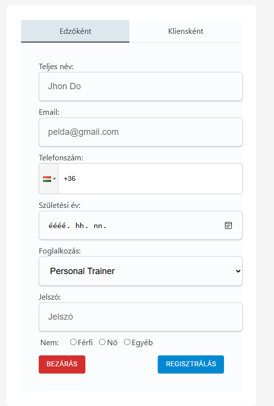

= Edzők kezelése - Funkcionális modell

== Leírás

== Használati esetek

=== Használati eset diagram

=== Használati esetek rövid leírása
==== Edzők listázása
[cols="1h,3"]
|===

| Azonosító
| UC_T_List

| Kiváltó esemény
| A felhasználó listázni kívánja az edzőket.

| Felhasználók
| Kliens, Edző

| Elsődleges lefutás
|
1. A felhasználó az Edzők listázása menüpontra kattint.

2. A rendszerben kiválogatásra kerülnek az edzők.

| Kivételek és alternatívák
| -

|Utófeltétel
|A rendszerben az edzők listája előállt.

| Eredmény
| A felhasználó látja az edzők listáját, kiválaszthat egyet közülük.

| Használati eset realizáció
| Technikai modell

|===

==== Edző rögzítése
[cols="1h,3"]
|===

| Azonosító
| UC_T_Create

| Kiváltó esemény
| A felhasználó új edzőt kíván rögzíteni.

| Felhasználók
| Edző

| Elsődleges lefutás
|
1. A felhasználó megadja az edző létrehozásához szükséges adatokat.

2. A felhasználó elindítja a rögzítés folyamatát.

3. A rendszerben rögzítésre kerül az új edző.

| Kivételek és alternatívák
| -

|Utófeltétel
|A rendszerben az edző rögzítésre került.

| Eredmény
| A felhasználó számára az imént rögzített edző elérhető a rendszerben.

| Használati eset realizáció
| Technikai modell

|===

==== Edző megtekintése
[cols="1h,3"]
|===

| Azonosító
| UC_T_Read

| Kiváltó esemény
| A felhasználó megkívánja tekinteni a kiválasztott edző adatait.

| Felhasználók
| Kliens, Edző

| Elsődleges lefutás
|
1. A felhasználó kiválasztja az edzőt.

2. A rendszerben lekérdezésre kerül a kiválasztott edző.

| Kivételek és alternatívák
| -

|Utófeltétel
|A rendszerben az edző lekérdezésre került.

| Eredmény
| A felhasználó látja a kiválasztott edző metaadatait.

| Használati eset realizáció
| Technikai modell

|===

==== Edző módosítása
[cols="1h,3"]
|===

| Azonosító
| UC_T_Patch

| Kiváltó esemény
| A felhasználó módosítani kívánja a kiválasztott edző metaadatát.

| Felhasználók
| Edző

| Elsődleges lefutás
|
1. A felhasználó megadja a módosítani kívánt adatot.

2. A felhasználó elindítja a módosítás folyamatát.

3. A rendszerben módosításra kerül az edző.

| Kivételek és alternatívák
| -

|Utófeltétel
|A rendszerben az edző módosításra került.

| Eredmény
| A felhasználó látja az edző módosított metaadatát.

| Használati eset realizáció
| Technikai modell

|===

==== Edző törlése
[cols="1h,3"]
|===

| Azonosító
| UC_T_Delete

| Kiváltó esemény
| A felhasználó törölni kívánja a kiválasztott edzőt a rendszerből.

| Felhasználók
| Edző

| Elsődleges lefutás
|
1. A felhasználó elindítja a törlés folyamatát.

2. A rendszerben törlésre kerül az edző.

| Kivételek és alternatívák
| -

|Utófeltétel
|A rendszerben az edző törlésre került.

| Eredmény
| A felhasználó a továbbiakban nem látja a törölt edző metaadatait.

| Használati eset realizáció
| Technikai modell

|===

==== Edző értékelése
[cols="1h,3"]
|===

| Azonosító
| UC_T_Post

| Kiváltó esemény
| A felhasználó módosítani kívánja a kiválasztott edző "rating" metaadatát.

| Felhasználók
| Kliens

| Elsődleges lefutás
|
1. A felhasználó megad egy értékelést.

2. A felhasználó elindítja az edző értékelései átlagolásának folyamatát.

3. A rendszerben módosításra kerül az edző.

| Kivételek és alternatívák
| -

|Utófeltétel
|A rendszerben az edző módosításra került.

| Eredmény
| A felhasználó látja az edző módosított metaadatait.

| Használati eset realizáció
| Technikai modell

|===

== Jogosultságok

[cols="1,1,1"]
|===
|Használati eset| Jogosultság| Szerepkörök

| Edzők listázása| TRAINER_LIST| Kliens, Edző
| Edző rögzítése| TRAINER_CREATE| Edző
| Edző megtekintése| TRAINER_READ| Kliens, Edző
| Edző módosítása| TRAINER_PATCH| Edző
| Edző törlése| TRAINER_DELETE| Edző
| Edző értékelése | TRAINER_POST| Kliens
|===

== Felületi terv

=== Edzők listázása felület

==== Arculat

==== A felületen lévő mezők

[cols="1,1,1,1,1"]
|===
|Név |Típus |Kötelező?| Szerkeszthető?| Megjelenés

|Edző neve |Header oszlopcím| I| I| Találati lista ablakrész
|Edző képe | Header oszlopcím| N| I| Találati lista ablakrész
|Edző képesítése | Header oszlopcím| I| I| Találati lista ablakrész
|Edző telefonszáma | Header oszlopcím| I| I| Találati lista ablakrész
|Edző átlag értékelése | Header oszlopcím| I| I| Találati lista ablakrész

|===

==== A felületről elérhető műveletek

[cols="1,1,1"]
|===
|Esemény |Leírás | Jogosultság

|Az "Edzőinkről" gombra kattintás |Végrehajtásra kerül az Edzők listázása használati eset. A találati listában megjelennek az edzők.| TRAINER_LIST

|===

=== Edző rögzítése vagy szerkesztése felület
==== Arculat

==== A felületen lévő mezők

[cols="1,1,1,1,1"]
|===
|Név |Típus |Kötelező?| Szerkeszthető?| Validáció

|Név |Szöveges input mező| I| I| Minimum 2, maximum 50 karakterből álljon
|Születési dátum |Dátum input mező| I| N|
|Nem |Választó gomb| I| N| Felvehető értékek: ["Male","Female","Other"]
|Kép |Fájl beviteli mező| N| I|
|Képesítés | "Qualification" input mező| I| I|
|Telefonszám | Szöveges input mező| I| I|
|Átlag értékelés | Double input mező| I| N|

|===

==== A felületről elérhető műveletek

[cols="1,1,1,1"]
|===
|Esemény |Leírás | Felület|Jogosultság

|A "Mentés" gombra kattintás
|Végrehajtásra kerül az Edző rögzítése használati eset. A felhasználó az edző megtekintése felületre jut.

A gomb mindaddig DISABLED amíg az űrlap nem valid.
| Edző létrehozása felület
| TRAINER_CREATE

|Az "Ok" gombra kattintás|
Végrehajtásra kerül az Edző módosítása használati eset. A felhasználó az edző megtekintése felületre jut.

A gomb mindaddig DISABLED amíg az űrlap nem valid.
| Edző módosítása felület
| TRAINER_PATCH

vagy TRAINER_POST ha az Értékelés gombra kattintva érkezett erre a felületre.

|===

==== A felületen lévő mezők

[cols="1,1"]
|===
|Megnevezés| Típus

|Név |Szöveges címke
|Születési dátum| Dátum címke
|Nem |Szöveges címke
|Kép |Szöveges címke
|Képesítés |Szöveges címke
|Telefonszám |Szöveges címke
|Átlag értékelés | Szám típusú címke egy tizedesjegy pontossággal.

|===

==== A felületről elérhető műveletek

[cols="1,1,1"]
|===
|Esemény |Leírás | Jogosultság

|A "Szerkesztés" gombra kattintás
|A felhasználó az edző szerkesztése felületre jut.
| -

|A "Törlés" gombra kattintás|
Megjelenik egy párbeszéd ablak.

Cím: Törlés

Üzenet: Biztosan törli a profilt?

A Nem gombra kattintásra eltűnik a párbeszédablak.

Az Igen gombra kattintásra végrehajtásra kerül az Edző törlése használati eset.
A felhasználó az edzők listázása felületre jut.

Ha a törlés nem sikerül, akkor az alábbi hibaüzenetek érkezhetnek:

| TRAINER_DELETE

|===

link:../functional-models.adoc[Vissza]